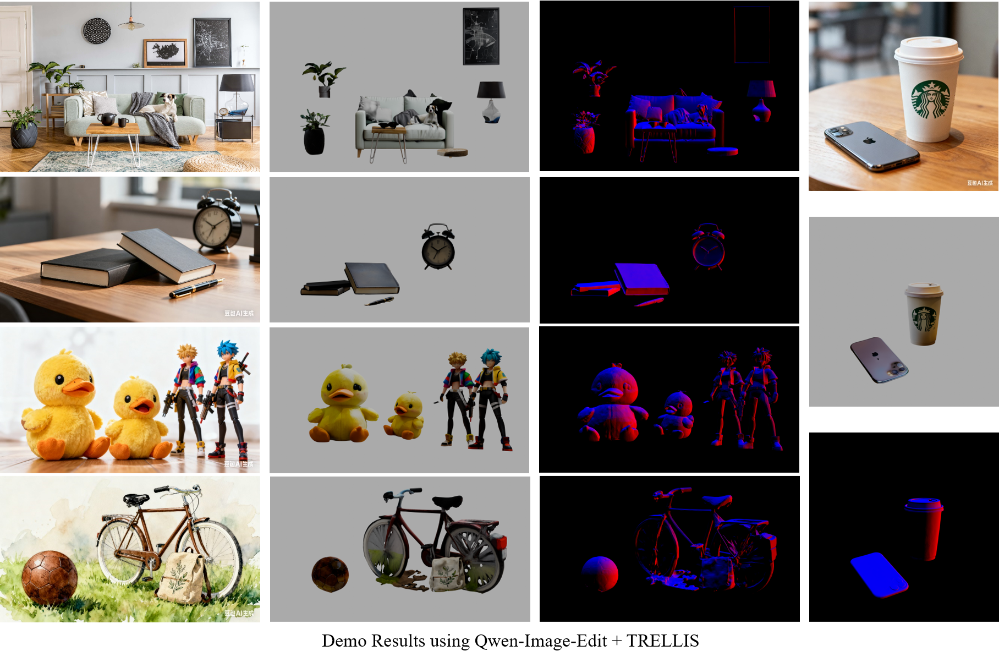
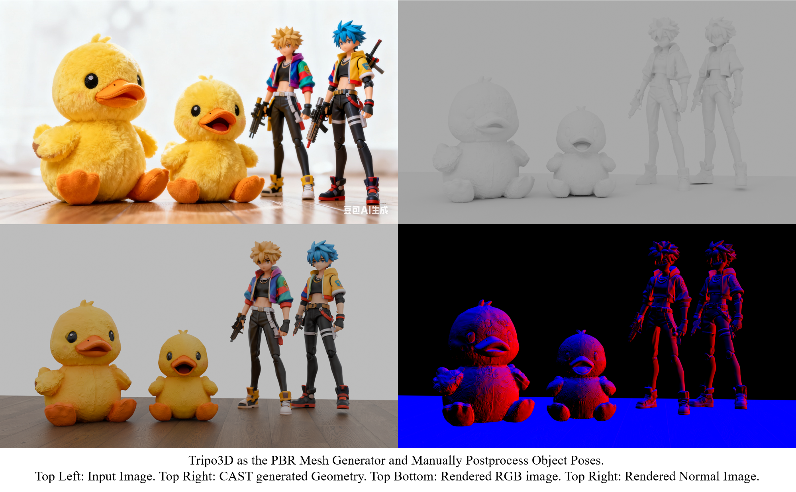
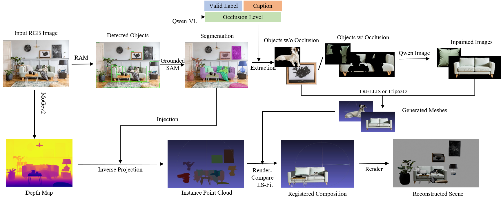

## Unofficial Implementation of CAST: Component-Aligned 3D Scene Reconstruction from an RGB Image
This REPO demonstrates an unofficial simplified implementation of SIGGRAPH 2025 Best Paper Nominate [CAST: Component-Aligned 3D Scene Reconstruction from an RGB Image](https://arxiv.org/abs/2502.12894). 

The pipeline is modular and can easily benefit from the progress of each module(e.g. image inpainting / mesh generation). To simplify the implementation, many modules of the system are based on existing **Serverless API** (e.g.Replicate/Qwen/Kontext/Tripo3D), making it easily deployed anywhere.

### CHANGELOG 
* 2025.11.03: Instead of ICP or DR, use **Render-and-Compare + OrientAnything** for rotation estimation, and use PyTorch based **least-square chamfer loss** for scale+translation optimization.
* 2025.10.31: Update more test cases, switch to **locally deployed Grounded-SAM**.

### Demo Results



### Disclaimer 
This repo is a **proof-of-concept and work-in-progress**. Since I don't want to (nor have the computational resources) to train the occlusion-aware generative model and the iterative registration approach, its performance **is NEVER** expected to approach the performance of the original paper. The results shown above are **NOT CHERRY-PICKED** and have some obvious artifacts. I am working to improving the results.

### Algorithmic Workflow



### Differences with the Paper 
1. Instead of using florence2 to first detect out objects in the image and then use Grounded-SAM to generate masks, here we use **[IDEA's RAM model](https://replicate.com/fishwowater/ram-grounded-sam-maskfixed)** to first predict boxes, then use qwen-vl to filter out invalid detections, finally using Grounded-SAM to generate segmentation. (It's **important** to filter out invalid detections before segmentation, otherwise the mask will be unclean).
2. The original paper puts a lot of efforts in training an occlusion-aware 3D generative model to support the mesh generation of seriously occluded objects in the image, here we use **a simplified and training-free scheme**: use Flux-Kontext / Qwen-Image to inpaint the occluded image, and then use off-the-shelf 3D generators like Tripo3D and TRELLIS to generate 3D models.
3. The original paper implements a point cloud conditioned model and iterative approach to register the 6D pose of an object. Here we first use **render-and-compare + OrientAnything** to estimate the object rotation, then optimizing the scale+translation with PyTorch least sqaured chamfer loss.

Detailed differences are summarized in the following table:

| Modules | Original Paper | This Repo |
| --- | --- | --- |
| Detection and Caption | Florence2    |  [RAM-Grounded-SAM](https://replicate.com/fishwowater/ram-grounded-sam-maskfixed) |
| Segmentation          | Grounded-SAM |  [Grounded-SAM](https://github.com/IDEA-Research/Grounded-Segment-Anything) | 
| Detection Filtering   |  GPT-4       |  [Qwen-VL](https://qwen3.org/vl/) | 
| Depth Estimation & PointCloud | MoGev1 |  [MoGev2](https://github.com/microsoft/MoGe/) | 
| Mesh Generation       | Occlusion-Aware self-trained 3D Generative model| [Kontext](https://replicate.com/black-forest-labs/flux-kontext-dev)/[Qwen](https://www.aliyun.com/product/tongyi) + [Tripo3D](https://www.tripo3d.ai)/[TRELLIS](https://replicate.com/firtoz/trellis) | 
| Pose Registration     | Occlusion-Aaware self-trained 3D Generative model | Least-Squared Fit + Render-and-Compare
| Physical Post-Processing | Scene Graph Guided SDF | TO BE DONE |
---

### Quick Start 
#### 0. System Requirements 
* OS: Windows / Ubuntu22.04 / CentOS8 Tested
* VRAM: GPU with 12GB VRAM or MORE (required for grounded-sam and DR-ICP)

#### 1. Setup 
``` shell 
git clone --recurse-submodules https://github.com/FishWoWater/CAST
# some asyncio support of replicate requires Python3.11 or higher version
conda create -n cast python=3.11 -y
conda activte cast 
python install_setup.py 

# following https://github.com/IDEA-Research/Grounded-Segment-Anything to install grounded-sam +ram, here is a brief example 
cd thirdparty/Grounded-Segment-Anything
export AM_I_DOCKER=False
export BUILD_WITH_CUDA=True
export CUDA_HOME=/usr/local/cuda
# install sam/ram depdencies 
python -m pip install -e segment_anything
pip install --no-build-isolation -e GroundingDINO
pip install --upgrade diffusers[torch]
git clone https://github.com/xinyu1205/recognize-anything.git
pip install -r ./recognize-anything/requirements.txt
pip install -e ./recognize-anything/
# numpy often gets broken 
pip install numpy==1.26.4
# download pretrained weights
wget https://dl.fbaipublicfiles.com/segment_anything/sam_vit_h_4b8939.pth
wget https://github.com/IDEA-Research/GroundingDINO/releases/download/v0.1.0-alpha/groundingdino_swint_ogc.pth
wget https://huggingface.co/spaces/xinyu1205/Tag2Text/resolve/main/ram_swin_large_14m.pth
wget https://huggingface.co/spaces/xinyu1205/Tag2Text/resolve/main/tag2text_swin_14m.pth

# setup env vars for replicate / qwen / tripo
cp .env.example .env 
```

### 2. Inference 
``` shell 
# check available parameters 
python -m cast.cli -h 

# inference example
python -m cast.cli -i assets/inputs/doll2.png --output outputs --enable-generation --pose-estimation-backend pytorch --generation-provider qwen --mesh-provider trellis
```


### TODO 
- [x] Further experiment with the differentiable rendering 
- [x] Test More Use Cases
- [ ] Clean up the legacy code branches and unused modules.  
- [ ] Implement the scene-graph and SDF guided object pose estimation. 


### Comparison with Existing Works
>*The advantage of CAST is its modular design, and can benefit from progress of each module in the community (until, I think, the end-to-end paradigm is strong enough one day).*
Basically there are two roadmaps to get a component-level reconstruction(generation) from a RGB image: End-to-End or procedural pipelines. 

1. [MIDI-3D](https://github.com/VAST-AI-Research/MIDI-3D) is a promising approach, but it's trained on 3D-Front and the generalization to outdoor scene / objects NOT guaranteed, besides the 6D pose of generated objects often not aligns well with the image.
2. [PartCrafter](https://github.com/wgsxm/PartCrafter) / [PartPacker](https://github.com/NVlabs/PartPacker) is basically object-centric, although PartCrafter has a model trained on 3DFront, an indoor scene dataset.
3. [ArtiScene](https://github.com/NVlabs/ArtiScene) is a promising procedural approach but it focuses on isometric scenes and is even more complicated 
4. [ReconViaGen](https://github.com/GAP-LAB-CUHK-SZ/ReconViaGen) is object-centric and requires multi-view images as the input, which is impossible for wide-angle or large scale scenes.
5. *[CUPID](https://github.com/cupid3d/Cupid) shows fantastic generation results of compositional scenes. **It's more end-to-end and more elegant**. This implementation may benefit from the image-aligned model from CUPID.

### Experiments / Trials
* Segmentation Module 
  * RAM for both detection & segmentation -> **inaccurate masks** 
  * RAM + Qwen-VL filtering + Grounded-SAM -> **better**
* Pose Registration module
  * [Differentiable Rendering - REPARO](https://github.com/VincentHancoder/REPARO) -> **NOT working**
  * Render-and-Compare + Qwen-VL -> **NOT working**
  * Render-and-Compare + CLIP-based view selection -> **NOT working**
  * Render-and-Compare + Orient Anything -> **work**

### Citation
If you find this implementation helpful, please consider to cite the original paper and this repo. Thank you very much :)
```
@article{2025CAST,
  title={CAST: Component-Aligned 3D Scene Reconstruction from an RGB Image},
  author={ Yao, Kaixin  and  Zhang, Longwen  and  Yan, Xinhao  and  Zeng, Yan  and  Zhang, Qixuan  and  Yang, Wei  and  Xu, Lan  and  Gu, Jiayuan  and  Yu, Jingyi },
  year={2025},
}

@software{CAST,
  author = {Junjie Wang},
  title = {Unofficial Implementation of CAST: Component-Aligned 3D Scene Reconstruction from an RGB Image},
  url = {https://github.com/FishWoWater/CAST},
  version = {0.1},
  year = {2025},
}
```

### LICENSE
See [License](./LICENSE). This work is licensed under MIT.

